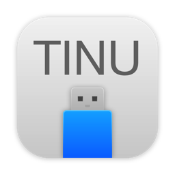

# TINU

TINU is the open tool to create bootable macOS installers.

[TINU Is Not Unibe**t]

This software is intended to be used to create a bootable macOS installer for computers capable of running Apple's macOS. This app, among other things, is also a GUI for the createinstallmedia executable that could be found in any macOS installer app from Mavericks up to the latest versions.

It allows you to easily create a macOS install media without messing around with command line stuff and without using Disk Utility, and also detects and prevents the most common errors with the creation of bootable vanilla macOS installers.

# For the latest Source code check out the development branch!

# Features:
- No need for guides or instructions! Just follow the very simple on-screen indications to very easily start the bootable macOS installer creation process.
- Fully open: You can see how this program works and you can freely contribute to it! (See the `Repository rules` and the `Note that` sections of this page)
- Support for multiple languages (currently just Italian and English, but more will be added with future updates once the system which allows it gets improved)
- Can work with every macOS installer app that has the `createinstallmedia` executable inside its internal resources folder (including also beta and newly released installers).
- 100% clean using the official apple's method: The bootable macOS installers created with this tool are made using the official apple's `createinstallmedia` method, just as if you created them using the command line, this ensures the best and the cleanest results avoiding all the problems that modded installers have.
- Does not require any special preparations. Just open the program, make sure you have a big enough USB drive plugged in (see the `Requirements` section) and have a macOS installer app on your disk.
- No need to use Disk Utility first. TINU can format your drive or partition for you, if it's necessary.
- Integrated downloads from Apple for lots of macOS/OS X installer apps (to access them open the app, go to the menu bar, and then `Tools->Download a macOS installer`).
- Integrated EFI partition mounter tool.
- Automatic Clover and OpenCore EFI folder installer.
- Tested to work on all the latest macOS releases.
- Makes use of the latest Swift 5 language and the latest Xcode release.

 (To suggest a new feature please contact us.)

# Requirements:
- A computer that runs Mac OS X Yosemite or a more recent version (Mac OS X El Capitan is required to use TINU inside a macOS Recovery/Installer OS).
- A drive or a free partition of least 8 GB (9+ for Catalina, 12+ for Big Sur and newer versions) that you want to turn into a macOS/Mac OS X installer (NOTE: partitions are usable only if they belong to a drive which uses the GUID partition format).
- A copy of a macOS/Mac OS X installer app (Mavericks or newer versions are supported), it's recommended to have the app placed into the /Applications folder or in the root of a volume connected to your computer (excepted the drive/volume you want to turn into your macOS install media).

# Download:
- You can download the pre-made executable of the app here: https://github.com/ITzTravelInTime/TINU/releases

# Building/Compiling requirements: 
- To compile a copy this app using the source code provided in this repo, Xcode 12.x or newer on a machine running at least Catalina is needed.

# Frequently asked questions (FAQs):
https://github.com/ITzTravelInTime/TINU/wiki/FAQs

# Useful links and contacts:
Thread (English) on insanelymac.com:
- http://www.insanelymac.com/forum/topic/326959-tinu-the-macos-installer-creator-app-mac-app/

Thread (Italian) on insanelymac.com:
- https://www.insanelymac.com/forum/topic/333261-tinu-app-per-creare-chiavette-di-installazione-di-macos-thread-in-italiano/

Thread (English-German) on hackintosh-forum.de:
- https://www.hackintosh-forum.de/index.php/Thread/33630-TINU/ 

Contact the project creator (ITzTravelInTime aka Pietro):
- Twitter:
    https://twitter.com/piecaruso97
- Reddit profile:          
    https://www.reddit.com/user/ITzTravelInTime
- email:                  
    piecaruso97@gmail.com
    
# Swift packages used:

- https://github.com/ITzTravelInTime/Command
- https://github.com/ITzTravelInTime/CommandSudo
- https://github.com/ITzTravelInTime/SwiftCPUDetect
- https://github.com/ITzTravelInTime/SwiftLoggedPrint
- https://github.com/ITzTravelInTime/TINUNotifications
- https://github.com/ITzTravelInTime/TINURecovery

# Repository rules:
- Respect the GNU GPL V2 license please!
- If you want to create your own modified fork of TINU please let the project maintainers know!
- If you believe that your changes may help with the main branch, create your own fork, apply your changes to it and then create a pull/merge request to the main branch here to let the changes be applyed more easily by the repository maintainers, and also have you credited for your work.
- Create an issue here on GitHub for any problems, bugs, bug fixes, spelling or grammar errors, mis-placements or just for suggestions (ones from designers and developers are always especially welcome).

# Note that:
- We (the project creator and other people involved with active development) assume no responsibility for any use of this app or source code; use them at your own risk!
- We (the project creator and other people involved with active development) do not guarantee support to you; this is only an open source project done in our free time, not a product released by a company!
- This project is born only for educational and demonstrative purposes, it's not intended to be used for commercial purposes.
- This is a no-profit project, born only to let people to create macOS install media in a simpler way and also to let them learn how to create these kind of apps.
- Changes to the provided source code are documented using git, so for any info about any changes made please see the commit history here on the repo.

# Credits:
- Apple for macOS, system icons and installer apps (and their createinstallmedia executable).
- Special thanks to:
Francesco Perchiazzi, Nicola Tomarelli, Roberto Sciortino, Raffaele Sonnessa, Ermanno Nicoletti, Tommaso Dimatore, Michele Vitiello Bonaventura, Massimiliano Faralli, Davide Dessì, Giorgio Dall'Aglio, Peter Paul Chato, Antonio De Masi, the Facebook group ["Italian Hackintosh group!!"](https://www.facebook.com/groups/Italia.hackintosh/), the Telegram group ["Hackintosh Italia"](https://t.me/Hackintoshitalia) and the community from hackintosh-forum.de .
- Matthew Elvey for README copyediting.
- Gianmarco Gargiulo for the current app icon and usb drive image.
- Thomas Tempelmann for help with the UI, grammar and the code.
- Pietro Caruso (ITzTravelInTime) project creator, maintainer and main developer.

# Legal info:
TINU is the open tool to create bootable macOS installers.
Copyright (C) 2017-2021 Pietro Caruso (ITzTravelInTime)

This program is free software; you can redistribute it and/or modify
it under the terms of the GNU General Public License as published by
the Free Software Foundation; either version 2 of the License, or
(at your option) any later version.

This program is distributed in the hope that it will be useful,
but WITHOUT ANY WARRANTY; without even the implied warranty of
MERCHANTABILITY or FITNESS FOR A PARTICULAR PURPOSE. See the
GNU General Public License for more details.

You should have received a copy of the GNU General Public License along
with this program; if not, write to the Free Software Foundation, Inc.,
51 Franklin Street, Fifth Floor, Boston, MA 02110-1301 USA.
